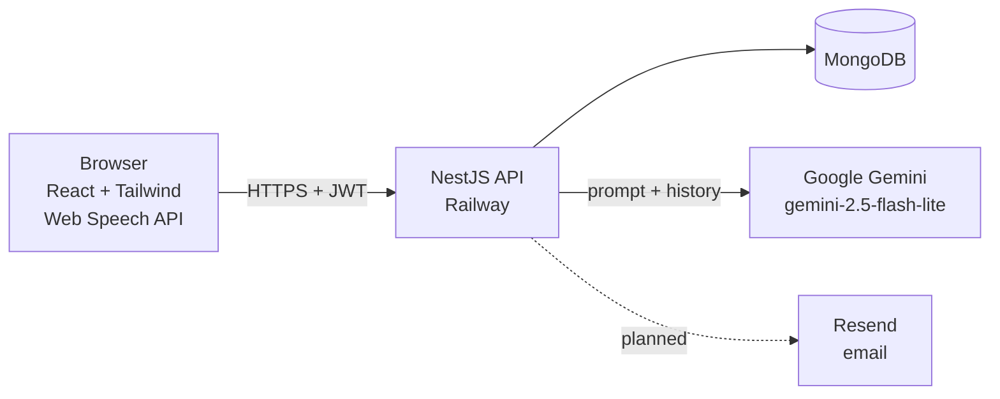

# AI Italian Tutor: Project Overview

## What it is

A web app where learners practise Italian by chatting with an AI tutor. The tutor adapts to the learner's level, corrects mistakes in the learner's own language, and can listen and speak using the browser's voice features.

**Who it's for:** English speakers (and others) learning Italian at A1–C2 level.

**Why it exists:** a portfolio project showing a full-stack AI product built with production concerns in mind: auth, rate limiting, cost control, validation, and deployment.

## Features

- Sign up / log in (JWT)
- Start a chat session by choosing level, mode, and focus area (e.g. *Passato Prossimo*)
- AI tutor replies in Italian and explains corrections in the learner's support language
- Voice input (speech-to-text) and voice output (text-to-speech), Chrome/Edge
- Free tier with 5 AI calls per user (the session opener counts as one). Deliberately small: the app runs on the free Gemini tier and must not cost money
- Bring-your-own Gemini API key for unlimited use
- Multi-language UI (support language is switchable)
- Email verification via Resend (**planned**, not implemented yet)

---

## Architecture

### How a chat message flows

1. User types or speaks a message. Speech is turned into text in the browser.
2. Client sends `POST /chat/send-message` with `sessionId` and `message`, plus the JWT.
3. Server checks: valid token → rate limit → DTO validation → session belongs to user → quota.
4. Server loads the latest 20 messages, builds the system prompt (level, focus area, support language), and calls Gemini using the user's own key if saved (decrypted with `ENCRYPTION_KEY`), otherwise the app key (`GOOGLE_API_KEY`).
5. On success: save the user message and the AI reply, count one call against the quota (`fallbackCount`, app key only), return the reply.
6. On failure: return an error. Nothing is saved or counted.

> Target behaviour. Today (before branches 1–2) the throttler is not registered, the user message is saved before the AI call, history is the first 20 messages, and Gemini failures are saved and counted as tutor replies.
7. Client shows the reply; the user can play it aloud.

### Data model (main fields)

**User**: `name`, `email` (unique), `password` (bcrypt hash), `italian_level`, `supportLanguage`, `geminiApiKey` (optional, AES-256-CBC encrypted), `fallbackCount` (free-tier calls used), `isVerified` (currently defaults to `true`), `verificationToken`, `createdAt`, `updatedAt`

**ChatSession**: `user_id`, `level`, `mode` (`grammar` or `topic`), `focus_area`, `createdAt`, `updatedAt`

**ChatMessage**: `session_id`, `sender` (`user` or `ai`), `content`, `createdAt`, `updatedAt`

### API endpoints (main)

| Method | Route | Purpose |
|---|---|---|
| POST | `/auth/signup` | Create account |
| POST | `/auth/login` | Get JWT (30-day expiry today) |
| POST | `/chat/start-session` | Start a session (AI sends an opener) |
| GET | `/chat/sessions` | List the user's sessions |
| GET | `/chat/sessions/:id/messages` | Get a session's messages (owner check **missing today**, fixed in branch 1) |
| POST | `/chat/send-message` | Send a message, get the tutor's reply (throttle declared, not active today) |
| DELETE | `/chat/sessions/:id` | Delete a session and its messages (owner only) |
| PUT | `/users/api-key` | Save own Gemini key |
| PUT | `/users/language` | Change support language |
| GET | `/` | "Hello" stub |
| GET | `/health` | Health check (**planned**, branch 4) |

All routes under `/chat` and `/users` require the JWT. Routes match the controllers in `server/src`; keep this table up to date.

### Key design decisions

| Decision | Why | Trade-off |
|---|---|---|
| JWT in `localStorage` | Simple across Vercel ↔ Railway domains | Exposed if XSS happens; mitigated by shorter expiry. httpOnly cookie is the long-term fix. |
| Bring-your-own key | Keeps AI costs bounded after the free tier | Extra setup step for heavy users |
| Free-tier quota + rate limiting | Stops one user or bot draining the Gemini budget | Viewers get a limited trial |
| Web Speech API | Free, no extra service | No Firefox support; Safari is patchy |
| Plain-text tutor replies | Fast to build | Corrections can't be highlighted; structured output is planned |

---

## Build plan

Branches are done in order, one at a time. Details and status are in `progress-tracker.md`. Issue numbers (`#1`–`#30`) refer to `audit-2026-10.md` in this folder.

### Phase 1: Demo-ready (before the LinkedIn post)

| # | Branch | Goal | Audit issues |
|---|---|---|---|
| 1 | `fix/security-hardening` | Rate limiting, ownership checks, strict validation, CORS, shorter JWT for new tokens (existing 30-day tokens keep working) | #1, #4, #8, #9, #11, #12 |
| 2 | `fix/ai-reliability` | Honest error handling, correct history, fair quota (stays at 5), clearer prompt | #5, #6, #7, #13, #14 |
| 3 | `fix/auth-ux` | Login errors stay visible, no crash on bad storage | #2, #10 |
| 4 | `chore/deploy-config` | SPA routing on Vercel, env docs, real title/favicon/OG tags, health check | #16, #17, #23, #29 |
| 5 | `feature/email-verification` | Verify emails with Resend; clean up unused email env vars | #3 |
| 6 | `fix/voice-ux` | Visible voice errors, browser support handling, send-failure state | #19, #20, #21 |
| 7 | `chore/tests-lint` | Working tests and lint, dead code removed | #24, #25, #26 |
| 8 | `docs/readme` | README with setup, architecture, screenshots, env table | #27 |

### Phase 2: After the demo

| Branch | Goal | Audit issues |
|---|---|---|
| `feature/structured-output` | Gemini `responseSchema` → `{reply, corrections[], newVocab[]}`; corrections shown as inline highlights | #15 |
| `feature/streaming` | Stream replies (SSE) so the tutor feels fast | — |
| `feature/session-summary` | End-of-session card showing mistakes by grammar topic | — |
| `chore/cleanup` | i18n for remaining strings, split `Dashboard.jsx`, httpOnly cookie auth, code-splitting | #22, #26, #9, #28 |
| `chore/ci` | GitHub Actions running tests and lint on every PR | — |
